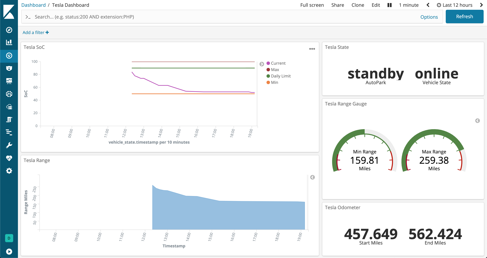

# tesla-es-poller
Simple, and poorly-written Node.js app for querying Tesla's owner API and pushing to Elasticsearch

# Disclaimers
This code was banged out in a couple of hours, there is very little to no exception 
handling, and the password is stored in plain text on your local system. If someone
were to gain access to your .env file, they would have the password to your cars. 

This code will NOT wake your car up, I will probably add that on a different interval soon.

# Instructions
1. Run npm install in main project directory: `npm i`
2. Copy sample.env configuration file and name it `.env`
3. Enter email and password for Tesla and for your Elasticsearch instance (leave blank if <<*gasp*>> it is unsecured)
4. (optional) Change polling interval to your preference, value is in milliseconds, default is 60000 (1 minute)
5. Start it: `npm start`

